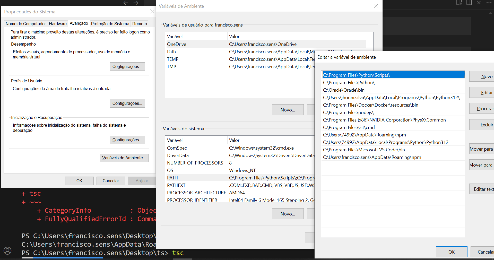

# Curso de Typescript

## Instalação do typescript
- Instalação do [Node.js](https://nodejs.org/pt)
- Instalação do [VsCode](https://code.visualstudio.com/)
- Instalação do TypeScript:
    ```
    npm install -g typescript
    ```
- Adicionar nas Variáveis de Ambiente o caminho dos pacotes instalados, que permite depois executar o transpilador do typescript
    ```
    npm config get prefix
    ```
    
- Habilitar a execução de .ps1
    ```
    Set-ExecutionPolicy Unrestricted -Force
    ```
- Transpilar o código do ts para js
    ```
    tsc app.ts
    ```
- Executar o código js transpilado
    ```
    node app.js
    ```
